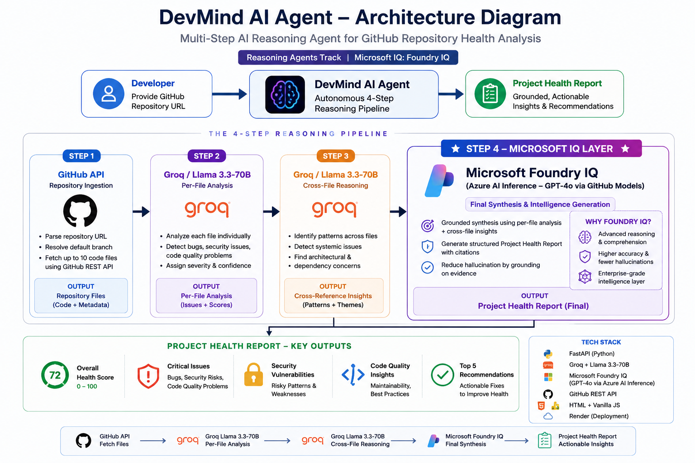

# DevMind AI Agent 🧠

> Multi-step AI reasoning agent for GitHub repository health analysis, powered by Microsoft Foundry IQ.

**🏆 Microsoft Agents League Hackathon 2026 — Reasoning Agents Track**

🔗 **[Live Demo](https://devmind-agent.onrender.com)** | https://devmind-agent.onrender.com/  |Track: Reasoning Agents | Microsoft IQ: Foundry IQ

## 🎥 Demo Video

Watch the full demo here:

https://www.youtube.com/watch?v=uny7i4pHSk8

---

## What It Does

DevMind AI Agent takes any public GitHub repository URL and runs a 4-step intelligent analysis pipeline — autonomously fetching files, analyzing each one, cross-referencing issues across the codebase, and generating a grounded Project Health Report via Microsoft Foundry IQ.

## The 4-Step Reasoning Pipeline

```
GitHub URL
    │
    ▼
Step 1 — GitHub API
    Parses the URL, resolves the default branch,
    fetches up to 10 code files via GitHub REST API
    │
    ▼
Step 2 — Groq / Llama-3.3-70b  (fast per-file analysis)
    Analyzes each file individually:
    bugs, security issues, code quality, severity
    │
    ▼
Step 3 — Groq / Llama-3.3-70b  (cross-file reasoning)
    Identifies systemic patterns across all files:
    recurring issues, inconsistencies, architecture concerns
    │
    ▼
Step 4 — Microsoft Foundry IQ  ★ Required IQ Layer
    Azure AI Inference endpoint (GitHub Models / GPT-4o)
    Synthesizes grounded, cited Project Health Report
    │
    ▼
Project Health Report
    Overall health score (0-100), critical issues,
    security vulnerabilities, top 5 recommended actions
```

## Microsoft IQ Integration

This project uses **Microsoft Foundry IQ** as the intelligence synthesis layer.

| Detail | Value |
|--------|-------|
| IQ Layer | Foundry IQ |
| Endpoint | `https://models.inference.ai.azure.com` (Azure AI Inference) |
| Model | GPT-4o via GitHub Models |
| Role | Grounded final synthesis — reduces hallucination by grounding on structured per-file evidence from Steps 2 & 3 |

The dual-model architecture is intentional: Groq/Llama handles fast parallel file analysis, while Foundry IQ handles the structured, cited final synthesis that requires higher reasoning quality.

## Architecture Diagram


## Tech Stack

| Layer | Technology |
|-------|-----------|
| Backend | FastAPI (Python) |
| Fast Analysis | Groq + Llama-3.3-70b-versatile |
| **Microsoft IQ** | **Foundry IQ — Azure AI Inference (GitHub Models / GPT-4o)** |
| Code Source | GitHub REST API |
| Frontend | HTML + Vanilla JS |
| Deployment | Render |

## Developer Tools (Additional Endpoints)

Beyond the agent, DevMind AI includes 5 standalone developer tools:

| Tool | Endpoint | Description |
|------|----------|-------------|
| Code Review | `POST /review` | Review code, find bugs, score out of 100 |
| Bug Hunt | `POST /bughunt` | Diagnose errors, get fixed code |
| Dev Docs | `POST /devdocs` | Generate README, API docs, or comments |
| Complexity | `POST /complexity` | Big-O analysis with optimized version |
| Git Commit | `POST /commit` | Generate conventional commit messages |

## Quick Start

```bash
git clone https://github.com/allen745/devmind-ai
cd devmind-ai
pip install -r requirements.txt
```

Create a `.env` file:
```
GROQ_API_KEY=your_groq_api_key
GITHUB_TOKEN=your_github_personal_access_token
```

> The `GITHUB_TOKEN` is used for two purposes:
> 1. Microsoft Foundry IQ access via Azure AI Inference (GitHub Models endpoint)
> 2. Higher GitHub API rate limits when fetching repository files

```bash
uvicorn main:app --reload
```

Open `http://localhost:8000` in your browser.

## Agent API

```bash
curl -X POST https://devmind-agent.onrender.com/agent/analyze-repo \
  -H "Content-Type: application/json" \
  -d '{"repo_url": "https://github.com/owner/repo"}'
```

**Response:**
```json
{
  "repo": "owner/repo",
  "files_analyzed": 8,
  "intelligence_layer": "Microsoft Foundry IQ — Azure AI Inference (GitHub Models / GPT-4o)",
  "pipeline": ["Step 1: GitHub API", "Step 2: Groq/Llama", "Step 3: Cross-reference", "Step 4: Foundry IQ"],
  "file_analyses": [...],
  "cross_reference_insights": "...",
  "project_health_report": "## OVERALL HEALTH SCORE: 72/100\n..."
}
```

## Requirements

```
fastapi
uvicorn
pydantic
python-dotenv
requests
groq
azure-ai-inference
azure-core
```

## Built By

Allen Stivanson Christian | Patent Holder  — 2nd year AI & Data Science student, A.D. Patel Institute of Technology, India

**Microsoft Agents League Hackathon 2026**
Track: Reasoning Agents | Microsoft IQ: Foundry IQ | Target Awards: Best Reasoning Agent, Best Use of IQ Tools, Top Student Award
